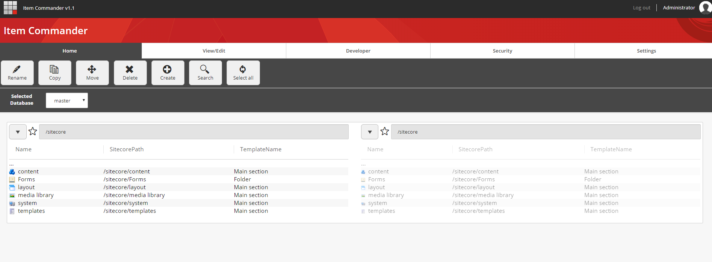
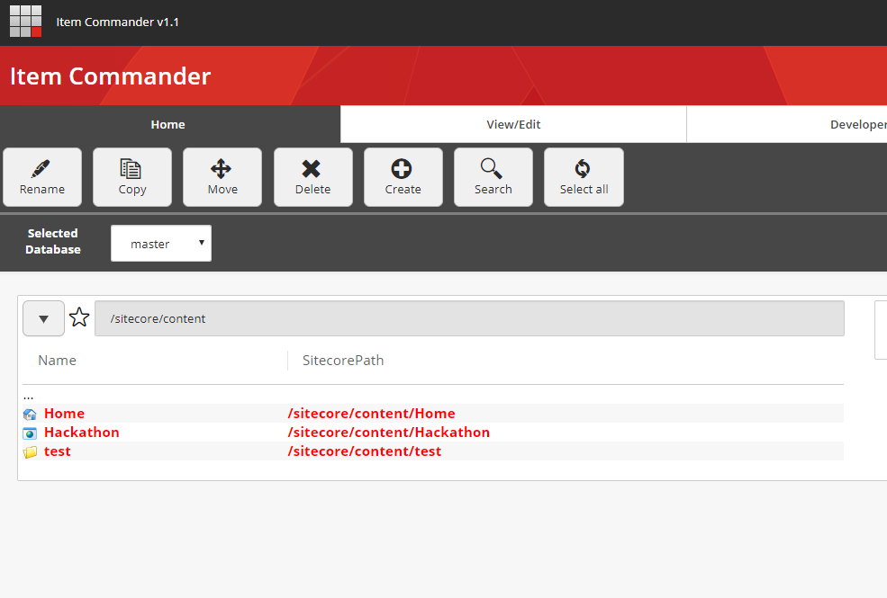
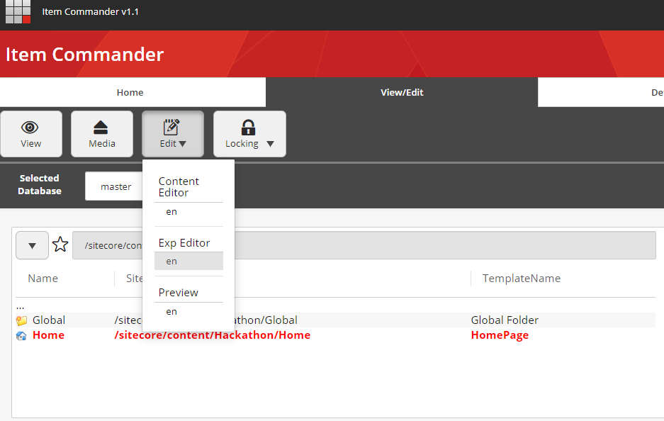
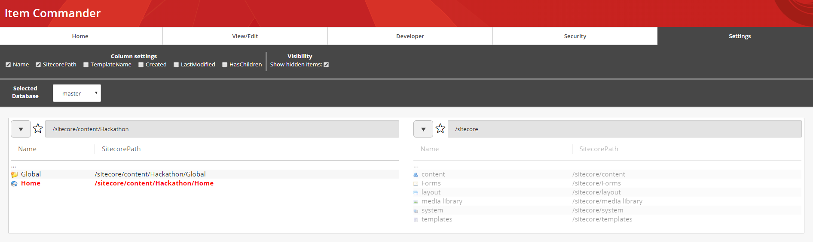
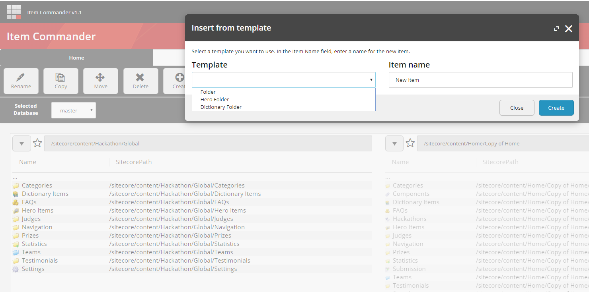
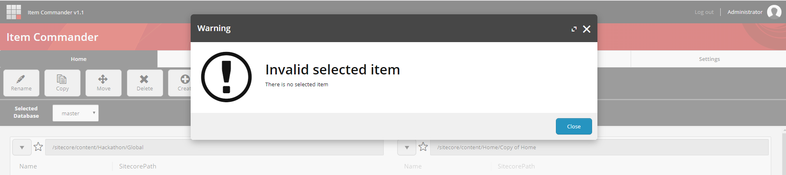
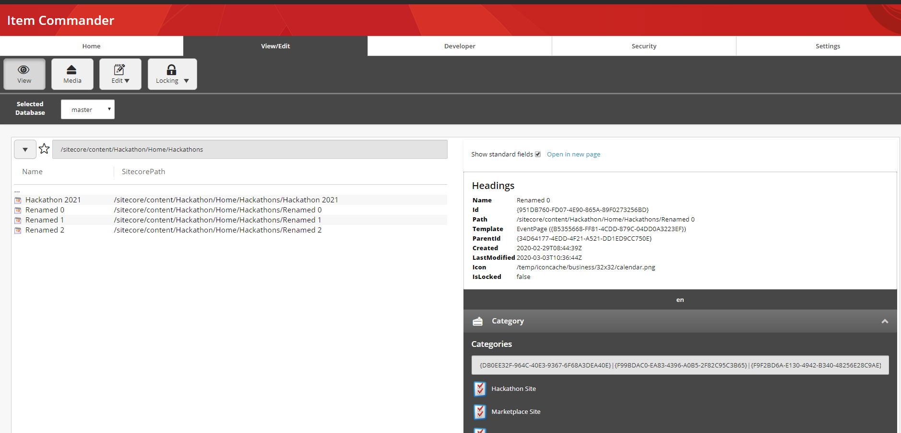
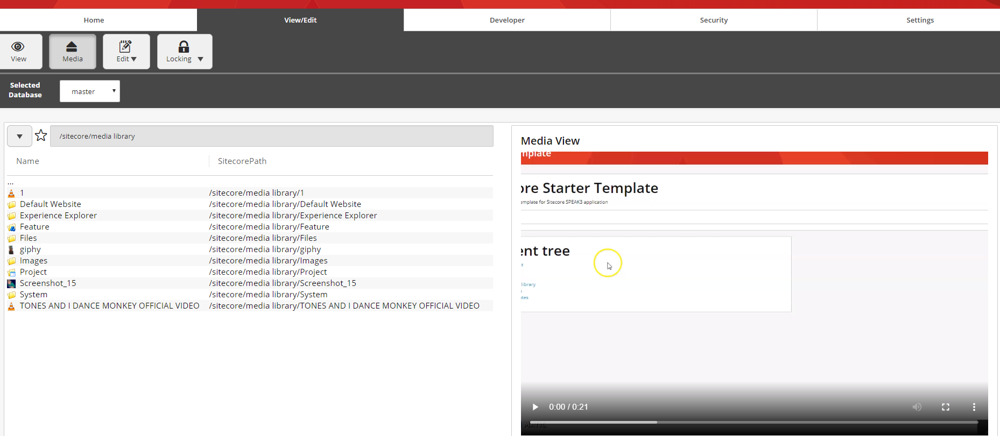
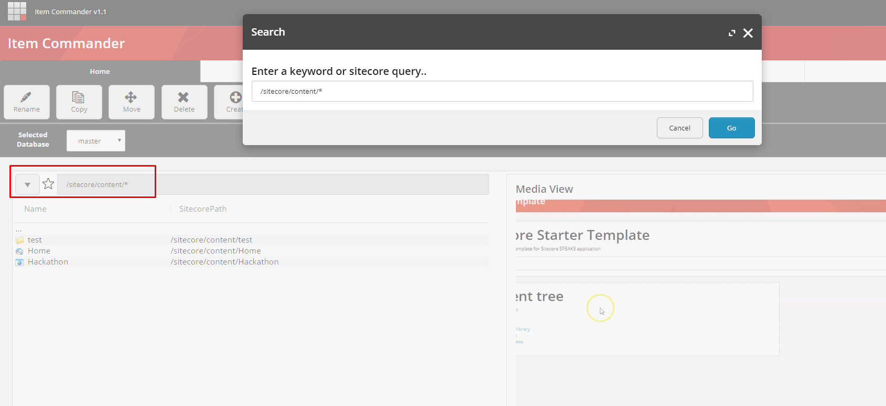

# Documentation

The repository contains source code and documentation for Item Commander Application

The purpose of the module is speeding up item manipulation in Sitecore.

You can read more about the module on [Medium](https://medium.com/@mitya_1988/item-commander-1aa157bbbd0)

This project was generated with [Angular CLI](https://github.com/angular/angular-cli) version 1.2.7.

### Features
The module has the following built in features

#### Commander View
Commander view gives file commander look to your Sitecore Content Tree. Left and right hand sided panels are added to the applications. 
You can navigate in your content tree by clicking on items in this view. 
- Current path is displayed above the panel
- You can go deeper in the tree by clicking on items.
- Single and Multiple selects are allowed (by right click)
- Database selection is allowed (which database's items are displayed in the commander view)
- Displayed columns are configurable (Show/Hide columns)
- Showing hidden items

All of the commander view settings are stored in browser's local storage, so you can continue your work where you left it. 

#### Item Manipulations
Several item manipulations are supported in the Item Commander.
- Copy (single and multiple with include subitems options)
- Move (single and multiple)
- Delete (single and multiple)
- Insert item (You can select inserted template based on the available insert options)
- Download items in Sitecore package (single and multiple)
- Lock and Unlock items (single and multiple)
- Search (you can search for item and apply any of the mentioned item manipulation)
- Open in Content Editor
- Open in Fast View
- Track progress in a progressbar

#### Fast View
Fast view allows you to check the selected item's fields. If multiple language is available for the selected item, then each language version's fields are displayed in a seperated tabls
- Hide standard fields from UI
- Copy values to clipboard

#### Media View
Media view allows you to check the selected media item
- Play Video/Audio files
- Display images
- Download the attached file
 
## Supported Sitecore Versions

- Sitecore 9.0
- Sitecore 9.0 Update-1
- Sitecore 9.0 Update-2
- Sitecore 9.1 
- Sitecore 9.1 Update-1
- Sitecore 9.2
- Sitecore 9.3 
- Sitecore 10

## Releases
- 0.8  - [package](sc.package/ItemCommander-0.8.zip)
  - Initial Release
- 0.9 - [package](sc.package/ItemCommander-0.9.zip)
  - Added progress bar
  - support Sitecore 9.3
  - Added ServicesApiController instead of EntityService
- 1.0 - [package](sc.package/ItemCommander-1.0.zip)
  - Added support to include subitems during copy
  - Bugfixes
- 1.1 - [package](sc.package/ItemCommander-1.1.zip)
  - New UI
  - Media View
  - Searchbox supports Sitecore queries too
  - Open more Sitecore applications from the Commander View
  - Bugfixes

## Installation

Provide detailed instructions on how to install the module, and include screenshots where necessary.

1. Use the Sitecore Installation wizard to install the [package](sc.package/ItemCommander-0.8.zip)
2. Make sure if your search indexes are working correctly
3. Go the LaunchPad and open the Item Commander.

## Configuration

The package contains a configuration patch, which   sets the "Sitecore.Services.SecurityPolicy" to "ServicesOnPolicy" - it is required for the Speak application.

Settings in the Sitecore.ItemCommander.config

| Key        | Value           |
| ------------- |:-------------:| 
| ItemCommander.MaxNumberOfThreads      | Sets the maximum number of threads which will be used during multiple item manipulation. e.g copy, delete, move, etc | 

## Development server

Run `npm run start` for a disconnected mode. Navigate to `http://localhost:4123/`. The app will automatically reload if you change any of the source files.

## Run within Sitecore

1. Run `npm run build` command. 
2. Copy `dist` folder's content to your c:\{sitecoreRoot}\sitecore\shell\client\applications\itemcommander folder
3. Open your sitecore instance on http://{sitecoreHost}/sitecore/shell/client/applications/itemcommender
4. Publish Visual Studio Solution into your webroot

## Screenshots

![Proggressbar]documentation/proggressbar.png)

